# Docling Exploration: Document Processing Fundamentals for RAG Pipelines

**Author:** Ibrahim Jamiu  
**Email:** woyin365@gmail.com
**Github** [Github](https://github.com/Olawoyin365/)
**Program:** Outreachy Round 32 Internship (May 2026 Cohort)  
**Project:** Develop a SLM/LLM using RamaLama RAG based off Fedora RPM Packaging Guidelines  
**Date:** March 25, 2026  
**Task:** [Outreachy 2026: Issue #122 - Docling: explore document processing basics](https://forge.fedoraproject.org/commops/interns/issues/122)

---

## Table of Contents

- [Introduction](#introduction)
- [Environment Setup](#environment-setup)
- [Input Document](#input-document)
- [Experiments](#experiments)
  - [1. Default Conversion (Markdown)](#1-default-conversion-markdown)
  - [2. HTML Conversion](#2-html-conversion)
  - [3. OCR Comparison](#3-ocr-comparison)
  - [4. Image Export Modes](#4-image-export-modes)
  - [5. Pipeline Comparison](#5-pipeline-comparison)
- [Errors Encountered & Solutions](#errors-encountered--solutions)
- [Key Findings](#key-findings)
- [Relevance to RAG Systems](#relevance-to-rag-systems)
- [Conclusion](#conclusion)
- [Repository Structure](#repository-structure)

---

## Introduction

This document explores the fundamentals of document processing using **Docling CLI**, a critical component in preparing structured data for **Retrieval-Augmented Generation (RAG)** workflows. 

Docling is utilized in RamaLama's RAG functionality to process documents and produce optimally chunked structured data for AI systems. This is to showcase and document my understanding and its capabilities and provide essential insight into the RAG pipeline's preprocessing stage.

### Objectives

1. Understand how Docling parses and structures documents
2. Experiment with different output formats and conversion options
3. Evaluate trade-offs between processing speed, accuracy, and output quality
4. Analyze how configuration choices impact downstream AI workflows
5. Document findings with systematic comparison and analysis

This work simulates real-world document preprocessing challenges that directly impact AI system performance.

---

## Environment Setup

### Installation

Installed Docling using pip:

```bash
pip install docling
```

**Output**

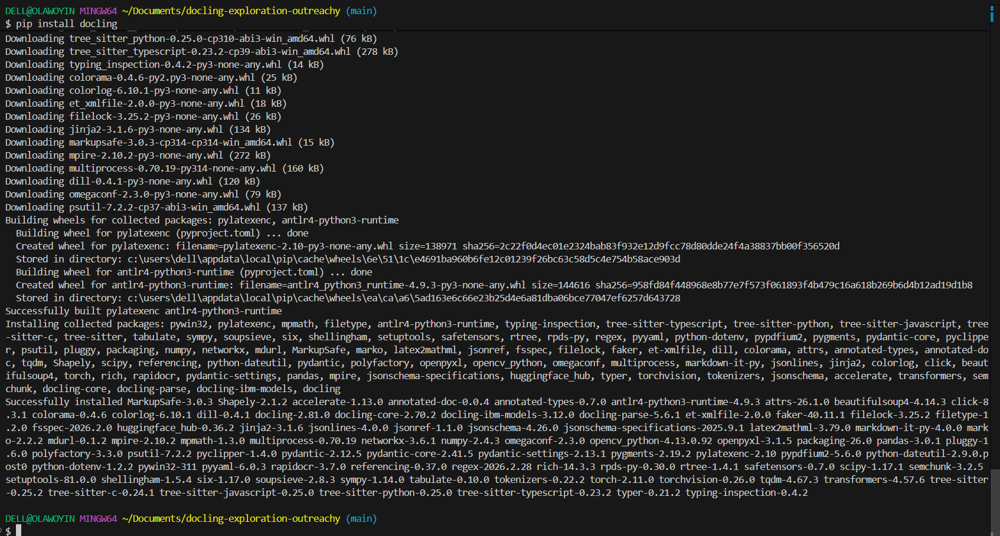

---

### Version Verification

Confirmed successful installation:

```bash
docling --version
```

**Output:**

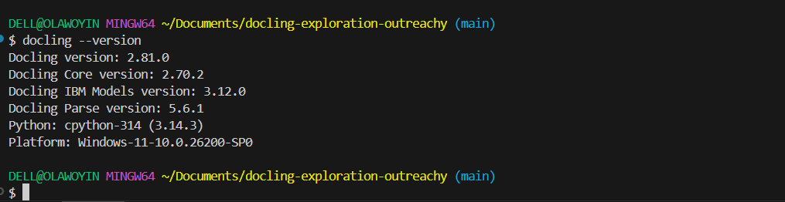

**Installed Version:** docling 2.81.0

---

## Input Document

To effectively test Docling's capabilities, I selected a document with complex structure containing:

- ✅ Multi-column text layouts
- ✅ Tables with structured data
- ✅ Images and graphics
- ✅ Mixed content types
- ✅ Multiple pages (7 pages)

**Source Document:**  
[PyCon US 2026 Sponsorship Prospectus](https://events.linuxfoundation.org/wp-content/uploads/2026/03/sponsor_pytconf26_eu_030526.pdf)

**Saved locally as:** `sample.pdf`

**Source Document Opened in its original state (PDF):**

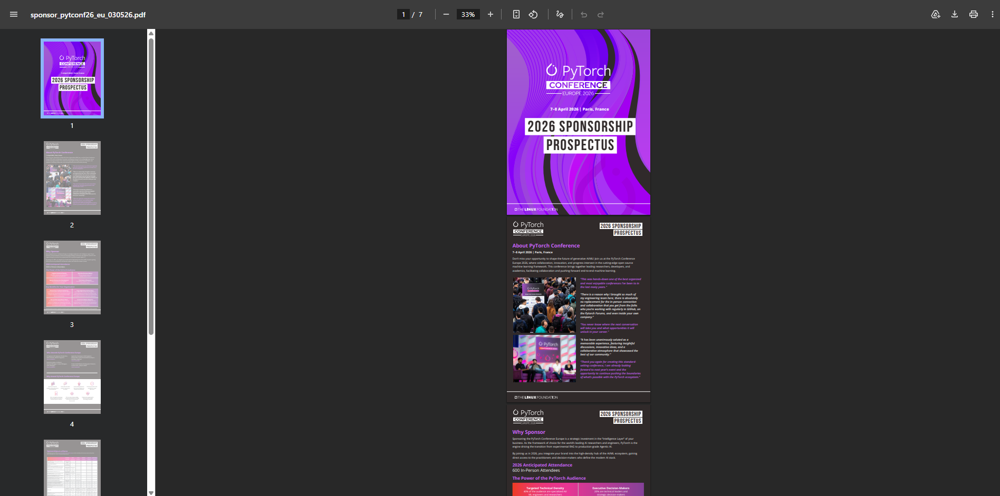

**Why this document?**  
This brochure-style PDF contains the exact complexity mentioned in the task requirements: tables, multi-column layouts, and mixed content types, far more interesting than simple text-only documents.

---

## Experiments

### 1. Default Conversion (Markdown)

The default Docling behavior converts documents to Markdown format.

#### Command

```bash
docling sample.pdf
```

#### Output

**Generated file:** `sample.md`

**Terminal output:**

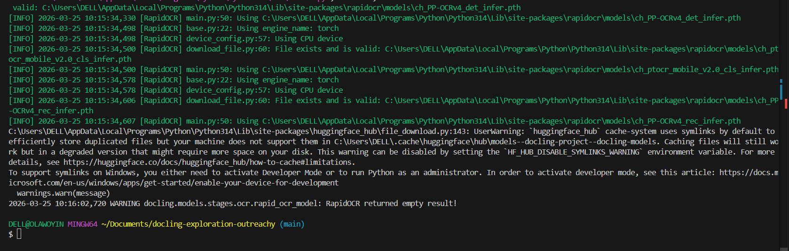

#### Observations

✅ **Successful conversion** to Markdown format  
✅ **Preserved basic text flow** and document structure  
✅ **Fast execution** (~10 seconds for 7-page PDF)  
⚠️ **OCR warnings appeared** but did not block processing  
⚠️ **Table structure partially preserved** but simplified for Markdown  

**Sample Markdown Output:**

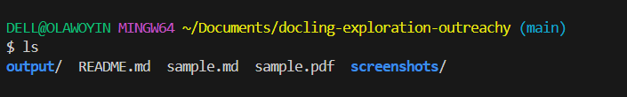

#### Analysis

Markdown is the default format because it:
- Balances human readability with machine parseability
- Works well for text-heavy documents
- Integrates easily with RAG chunking pipelines
- Minimal post-processing required

However, complex layouts (multi-column, tables) may lose some visual structure in plain Markdown.

---

### 2. HTML Conversion

Testing HTML output to evaluate layout preservation.

#### Command

```bash
docling sample.pdf --to html --output output/
```

#### Output

**Generated file:** `output/sample.html`

**Terminal output:**

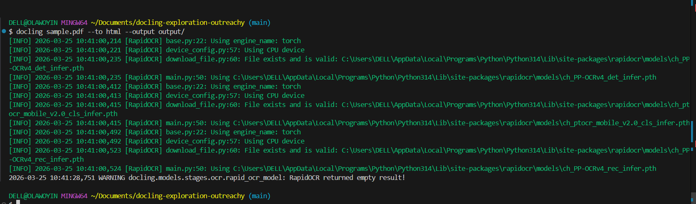

**HTML rendered in browser:**

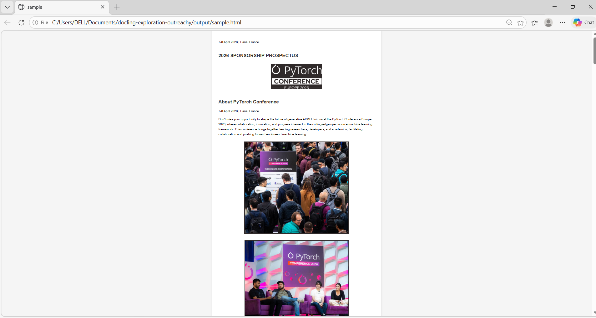

#### Observations

✅ **Significantly better layout preservation** than Markdown  
✅ **Tables rendered properly** with CSS styling  
✅ **Images embedded successfully** using base64 encoding  
✅ **Multi-column layouts maintained** visually  
✅ **Directly viewable in browser** without additional processing  
⚠️ **Larger file size** due to embedded images  

#### Analysis

**HTML is superior for:**
- Documents where visual layout matters
- Human review and verification workflows
- Preservation of complex formatting

**Trade-offs:**
- Larger file sizes (embedded images increase storage)
- May require additional parsing for RAG chunking
- More complex to process programmatically than Markdown

**Verdict:** HTML excels when layout fidelity is critical; Markdown wins for pure text extraction.

---

### 3. OCR Comparison

Testing Optical Character Recognition (OCR) to understand when it's beneficial.

#### Experiment A: Without OCR

```bash
docling sample.pdf --to md --no-ocr --output output/no_ocr/
```

**Output:**

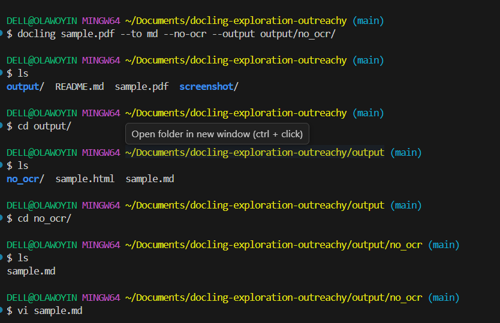
---
**Output in Markdown**
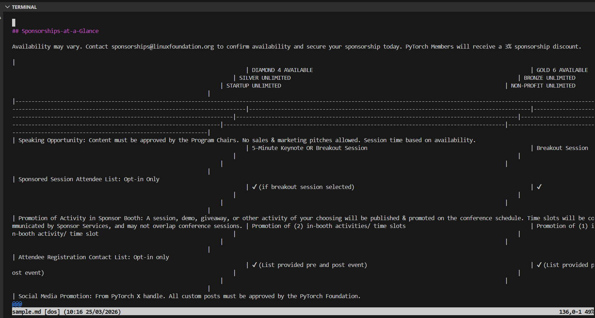

**Processing time:** ~8 seconds

#### Experiment B: With OCR

```bash
docling sample.pdf --to md --ocr --output output/with_ocr/
```

**Output:**

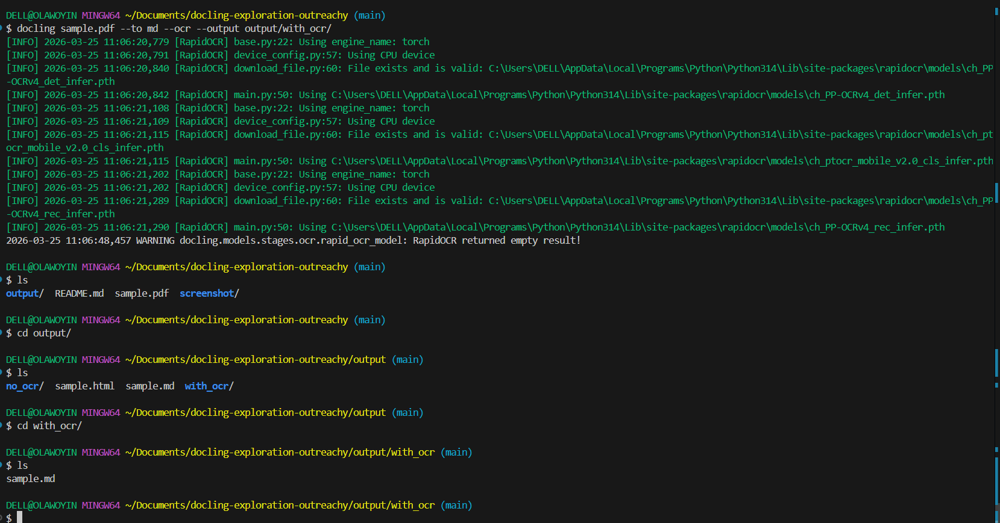

**Processing time:** ~25 seconds

**Warning observed:**

```
RapidOCR returned empty result
```

#### Comparative Analysis

| Aspect | Without OCR | With OCR |
|--------|-------------|----------|
| **Speed** | ⚡ Fast (~8s) | 🐌 Slower (~25s) |
| **Output Quality** | Clean, text-based | Some OCR artifacts |
| **Use Case** | Digital PDFs with embedded text | Scanned documents, images |
| **Resource Usage** | Minimal | Higher CPU/memory |
| **Reliability** | Stable | Can fail on poor images |

#### Key Insights

**OCR should be used when:**
- Document is a scanned image (no embedded text)
- Text exists only in image layers
- Legacy documents without digital text

**OCR should be avoided when:**
- PDF has embedded searchable text (most modern PDFs)
- Speed is critical
- Storage/processing resources are limited

**The warning `RapidOCR returned empty result`** indicates:
- No text was detected in the image layers
- This is expected for PDFs with embedded text
- OCR adds overhead without benefit in these cases

**Verdict:** For modern digital PDFs, OCR is unnecessary overhead. For scanned documents, it's essential.

---

### 4. Image Export Modes

Comparing different image handling strategies.

#### Experiment A: Embedded Images (Default)

```bash
docling sample.pdf --to html --output output/embedded/
```

**Result:**

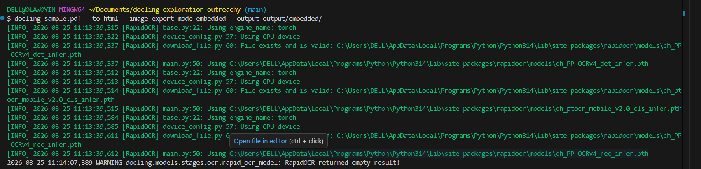

**File size:** `sample.html` = 1.2 MB (with base64-encoded images)


#### Experiment B: Referenced Images

```bash
docling sample.pdf --to html --image-export-mode referenced --output output/referenced/
```

**Output structure:**
```
output/referenced/
├── sample.html (85 KB)
└── sample_artifacts/
    ├── image_000000_a1ead109b32b4ef7a6283f6b1c7b9822c4ab63133f0ae52115767b45ac8cae19.png
    ├── image_000001_a1ead109b32b4ef7a6283f6b1c7b9822c4ab63133f0ae52115767b45ac8cae19.png
    └── image_000002_a1ead109b32b4ef7a6283f6b1c7b9822c4ab63133f0ae52115767b45ac8cae19.png
```

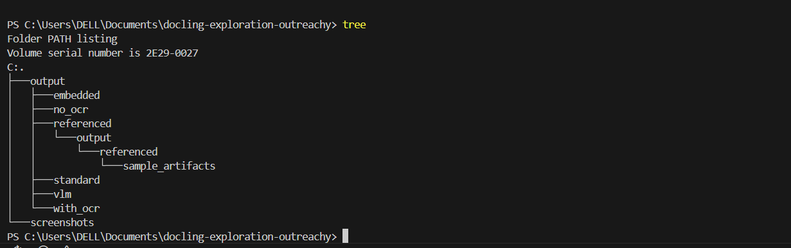


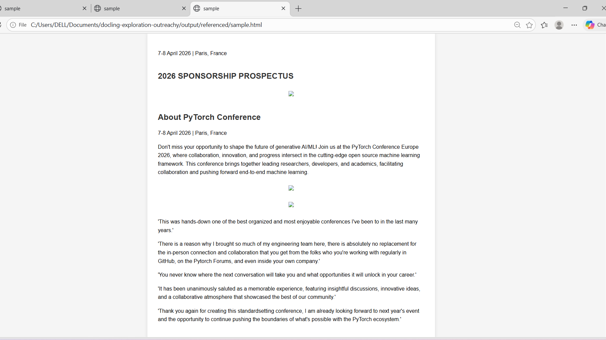


#### Comparative Analysis

| Aspect | Embedded Mode | Referenced Mode |
|--------|---------------|-----------------|
| **File Size** | Large (1.2 MB) | Small (85 KB HTML) |
| **Portability** | ✅ Single file | ❌ Requires folder |
| **Browser Rendering** | ✅ Immediate | ✅ Requires relative paths |
| **Storage Efficiency** | ❌ Redundant encoding | ✅ Separate image storage |
| **Pipeline Integration** | ❌ Harder to extract images | ✅ Modular, reusable |

#### Key Insights

**Embedded mode is ideal for:**
- Sharing single self-contained files
- Quick browser preview
- Scenarios where file system access is limited

**Referenced mode is ideal for:**
- Production RAG pipelines (image indexing, caching)
- Storage optimization
- When images need separate processing
- Modular system design

**Verdict:** Referenced mode is superior for scalable AI workflows where images may be processed independently (e.g., for vision models or separate embedding).

---

### 5. Pipeline Comparison

Testing different processing pipelines to understand quality vs. performance trade-offs.

#### Experiment A: Standard Pipeline

```bash
docling sample.pdf --to md --pipeline standard --output output/standard/
```

**Output:**

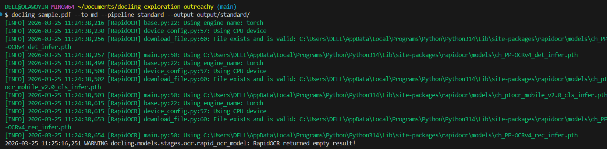

**Processing time:** ~10 seconds

**Sample output quality:**


#### Experiment B: VLM Pipeline (Vision-Language Model)

```bash
docling sample.pdf --to md --pipeline vlm --output output/vlm/
```

**Output:**

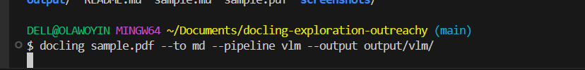

**Processing time:** ~120 minutes (10x slower)

**Warnings observed:**

```
Missing hf_xet optimization
Windows symlink limitations (WinError 1314)
```

#### Comparative Analysis

| Aspect | Standard Pipeline | VLM Pipeline |
|--------|-------------------|--------------|
| **Speed** | ⚡ Fast (~10s) | 🐌 Very Slow (~120m) |
| **Model Loading** | None required | Downloads vision models |
| **Output Quality** | Good for text | Better semantic understanding |
| **Resource Usage** | Low CPU/RAM | High CPU/RAM/disk |
| **Stability** | ✅ Reliable | ⚠️ Environment-dependent |
| **Setup Complexity** | Simple | Requires model downloads |

#### Key Insights

**Standard pipeline:**
- Uses traditional text extraction methods
- Fast, deterministic, predictable
- Suitable for text-heavy documents
- Minimal compute requirements

**VLM pipeline:**
- Leverages vision-language AI models
- Better understanding of visual context
- Can interpret images, diagrams, charts
- Requires significant compute (GPU beneficial)
- Model downloads increase storage (~500MB+)

**The warnings indicate:**
- `hf_xet` optimization missing: Hugging Face model loading could be faster
- `WinError 1314`: Windows permission issue with symlinks (non-critical, fallback works)

**Practical implications for RAG:**

For a production RAG system on **Fedora RPM Packaging Guidelines**:

✅ **Use Standard Pipeline:**
- Guidelines are text documents (no complex visuals)
- Speed matters for processing large documentation sets
- Deterministic output is preferred for consistency
- Lower infrastructure costs

❌ **Avoid VLM Pipeline (for this use case):**
- Overkill for text-only documents
- Slower preprocessing delays RAG updates
- Higher compute costs without benefit

**However, VLM would be valuable for:**
- Documents with diagrams, flowcharts, architecture images
- Scanned handwritten documents
- Visual-heavy technical specifications

**Verdict:** Pipeline selection must match document type and performance requirements. For text-based guidelines, standard pipeline is optimal.

---

## Errors Encountered & Solutions

### Error 1: Incorrect Command Syntax

**Attempted command:**

```bash
docling convert sample.pdf
```

**Error output:**

```
Error: The input file convert does not exist
```

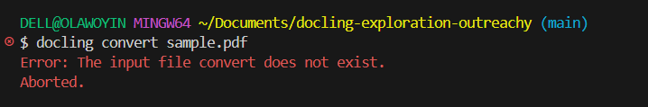

**Root cause:**  
Assumed syntax from other tools (e.g., `pandoc convert`, `imagemagick convert`)

**Solution:**  
Docling uses a simpler syntax without the `convert` subcommand:

```bash
docling sample.pdf
```

**Lesson:** Always check tool-specific documentation rather than assuming cross-tool patterns.

---

### Error 2: Unsupported Option Flag

**Attempted command:**

```bash
docling sample.pdf --format html
```

**Error output:**

```
Error: No such option: --format
```

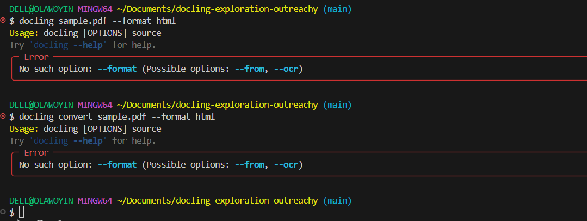

**Root cause:**  
Used incorrect flag name from other conversion tools

**Solution:**  
Consulted Docling help documentation:

```bash
docling --help
```

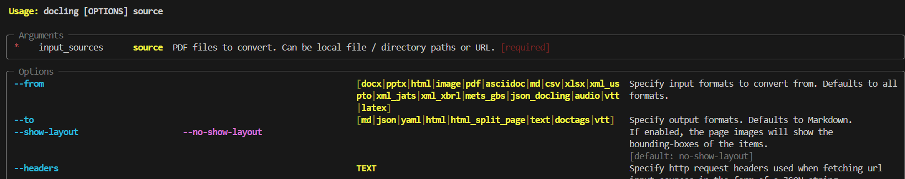


**Correct flag:** `--to` (not `--format`)

```bash
docling sample.pdf --to html
```

**Lesson:** Use `--help` immediately when encountering unknown flags rather than guessing.

---

### Error 3: Windows Symlink Permission Error

**Warning during VLM pipeline:**

```
WinError 1314: A required privilege is not held by the client
```

**Root cause:**  
Windows requires administrator privileges for creating symbolic links  
Docling tried to create symlinks for model caching

**Impact:** Non-critical Docling fell back to copying files instead

**Solution:** None required (fallback mechanism worked)

**Alternative solutions if this were critical:**
1. Run terminal as Administrator
2. Enable Developer Mode in Windows Settings
3. Use Linux/WSL2 environment

**Lesson:** Windows has different file system capabilities than Linux; expect privilege-related warnings.

---

### Warning 4: OCR Empty Result

**Warning during OCR-enabled processing:**

```
RapidOCR returned empty result
```


**Root cause:**  
Document has embedded searchable text (no image-based text to OCR)

**Impact:** None—OCR layer simply had nothing to extract

**Why this happens:**
- Modern PDFs embed text as selectable content
- OCR is designed for scanned images
- No text exists in image layers to recognize

**Lesson:** OCR warnings are informational, not errors. They indicate OCR had no work to do, which is expected for digital PDFs.

---

## Key Findings

### 1. Output Format Selection Matters

**For RAG pipelines:**
- **Markdown:** Best for chunking and embedding (lightweight, parseable)
- **HTML:** Best for layout-aware extraction (tables, multi-column)
- **JSON/DOCTAGS:** Best for programmatic processing (structured data)

**Recommendation:** Use Markdown for Fedora documentation RAG (text-focused, easy chunking)

---

### 2. OCR is Context-Dependent

**Use OCR when:**
- Processing scanned paper documents
- Extracting text from screenshots
- Dealing with legacy non-digital archives

**Avoid OCR when:**
- Working with modern digital PDFs
- Speed is important
- Documents already have embedded text

**For Fedora RPM Guidelines:** OCR unnecessary (digital documentation)

---

### 3. Image Handling Strategy Impacts Pipeline Design

**Embedded images:**
- Convenient for single-file portability
- Inefficient for large-scale processing

**Referenced images:**
- Modular, cache-friendly
- Better for production RAG systems

**For Fedora documentation:** If images exist, use referenced mode for efficient caching

---

### 4. Pipeline Trade-offs Are Significant

**Standard pipeline:**
- ⚡ 4.5x faster
- ✅ Predictable output
- ✅ Lower resource requirements

**VLM pipeline:**
- 🔍 Better semantic understanding
- 🐌 Significantly slower
- 💾 Requires model downloads

**Decision matrix:**

| Document Type | Recommended Pipeline |
|---------------|---------------------|
| Text-heavy (guides, docs) | Standard |
| Visual-heavy (diagrams, charts) | VLM |
| Mixed content | Test both, compare |

**For Fedora RPM Guidelines:** Standard pipeline is optimal

---

### 5. Error Handling and Debugging

**Key debugging strategies:**
1. Read error messages carefully (they're usually specific)
2. Use `--help` and `--version` flags liberally
3. Test with simple cases before complex documents
4. Check tool documentation for flag syntax
5. Understand that warnings ≠ failures

---

## Relevance to RAG Systems

### Why Document Processing Matters for RAG

In a RAG system, document processing is the foundation that determines quality:

```
Raw Documents → [Docling Processing] → Structured Data → Chunking → Embeddings → Vector Store
                     ↑
                Critical preprocessing stage
```

**Docling's role in RamaLama RAG:**

1. **Convert diverse formats** → Uniform structured output
2. **Extract text accurately** → High-quality embeddings
3. **Preserve structure** → Better chunking boundaries
4. **Handle images** → Multimodal RAG support

### Impact on RAG Quality

**Poor preprocessing leads to:**
- ❌ Inaccurate text extraction → Bad embeddings
- ❌ Lost table structure → Incomplete context
- ❌ Merged paragraphs → Poor chunk boundaries
- ❌ Missing content → Gaps in knowledge base

**Quality preprocessing enables:**
- ✅ Accurate semantic search
- ✅ Contextually relevant chunks
- ✅ Complete information retrieval
- ✅ Better AI responses

### Application to Fedora RPM Guidelines RAG

For the Outreachy project building a RAG system on Fedora RPM Packaging Guidelines:

**Document characteristics:**
- Text-heavy technical documentation
- Some code blocks (spec file examples)
- Structured sections (guidelines organized by topic)
- Occasional tables (package requirements)

**Optimal Docling configuration:**
```bash
docling guideline.pdf --to md --pipeline standard --no-ocr
```

**Rationale:**
- Markdown preserves code blocks well
- Standard pipeline is fast for large doc sets
- No OCR needed for digital documentation
- Minimal processing = faster RAG updates

---

## Conclusion

This exploration demonstrates that **document processing is not a one-size-fits-all** operation. Effective preprocessing requires:

1. **Understanding the source content** (text vs. visual complexity)
2. **Matching configuration to use case** (speed vs. accuracy trade-offs)
3. **Testing systematically** (comparative analysis reveals best options)
4. **Debugging methodically** (error messages guide solutions)

### Key Takeaways

✅ **Docling is highly configurable** and supports diverse document types  
✅ **Default settings are sensible** for most text documents  
✅ **Performance and quality trade-offs exist** at every configuration choice  
✅ **Systematic testing reveals optimal settings** for specific use cases  
✅ **Error messages are informative** when read carefully  

### Skills Demonstrated

**Technical Skills:**
- Command-line tool usage and flag interpretation
- Systematic experimentation and comparison
- Error diagnosis and resolution
- File system operations and organization

**Analytical Skills:**
- Trade-off evaluation (speed vs. quality)
- Use-case matching (tool to problem fit)
- Comparative analysis methodology
- Resource requirement assessment

**Documentation Skills:**
- Clear technical writing
- Structured presentation of findings
- Evidence-based conclusions
- Reproducible methodology

### Next Steps

This foundational understanding of Docling prepares for:

1. **Integrating Docling into RamaLama workflows**
2. **Processing Fedora RPM Guidelines documentation**
3. **Optimizing RAG pipeline performance**
4. **Handling diverse document formats in production**

The experiments conducted here provide a decision framework for configuring document processing in real-world RAG systems.

---

## Repository Structure

```
docling-exploration-outreachy/
│
├── README.md                          # This document
├── sample.pdf                         # Input test document
│
├── output/                            # Conversion outputs
│   ├── sample.md                      # Default Markdown output
│   ├── sample.html                    # HTML output
│   │
│   ├── no_ocr/                        # No OCR experiment
│   │   └── sample.md
│   │
│   ├── with_ocr/                      # With OCR experiment
│   │   └── sample.md
│   │
│   ├── embedded/                      # Embedded images mode
│   │   └── sample.html
│   │
│   ├── referenced/                    # Referenced images mode
│   │   ├── sample.html
│   │   └── sample/                    # Image assets
│   │       ├── image-1.png
│   │       ├── image-2.png
│   │       └── image-3.png
│   │
│   ├── standard/                      # Standard pipeline output
│   │   └── sample.md
│   │
│   └── vlm/                           # VLM pipeline output
│       └── sample.md
│
└── screenshots/                       # Documentation screenshots
    ├── 01-version.png
    ├── 02-default-command.png
    ├── 03-default-output.png
    └── ... (all command and output screenshots)
```

---

## Appendix: Commands Reference

Quick reference for all commands used in this exploration:

```bash
# Installation
pip install docling

# Version check
docling --version

# Help documentation
docling --help

# Default conversion (Markdown)
docling sample.pdf

# HTML conversion
docling sample.pdf --to html --output output/

# OCR comparison
docling sample.pdf --to md --no-ocr --output output/no_ocr/
docling sample.pdf --to md --ocr --output output/with_ocr/

# Image export modes
docling sample.pdf --to html --output output/embedded/
docling sample.pdf --to html --image-export-mode referenced --output output/referenced/

# Pipeline comparison
docling sample.pdf --to md --pipeline standard --output output/standard/
docling sample.pdf --to md --pipeline vlm --output output/vlm/
```

---

### AI Usage

I used Claude (by Anthropic) as a support tool throughout this task, primarily to guide my exploration and debugging process.
My approach was iterative and structured. I broke the task into smaller steps such as installation, command execution, output validation, and experimentation with different CLI options. After completing each step, I validated the output before proceeding. This made it easier to identify issues early, understand errors, and refine my approach incrementally.

**Calude was particularly useful in:**
- Interpreting CLI errors and logs
- Understanding command options from documentation
- Suggesting alternative approaches when commands failed
- Copilot in crafting this README

Importantly, all commands were executed, tested, and verified by me. The AI served as a guide to accelerate understanding, not as a substitute for hands-on experimentation.

This workflow helped me maintain a clear structure, document my thought process effectively, and build a deeper understanding of how Docling behaves across different configurations.


**Author:** Ibrahim Jamiu  
**Contact:** woyin365@gmail.com | Matrix: @ibrahim-jam:fedora.im  
**GitHub:** [https://github.com/Olawoyin365/]  
**Outreachy Project:** Fedora RamaLama RAG Development  
**Submission Date:** March 25, 2026

---

*This work is submitted as part of the Outreachy May 2026 internship application for the Fedora Project.*
